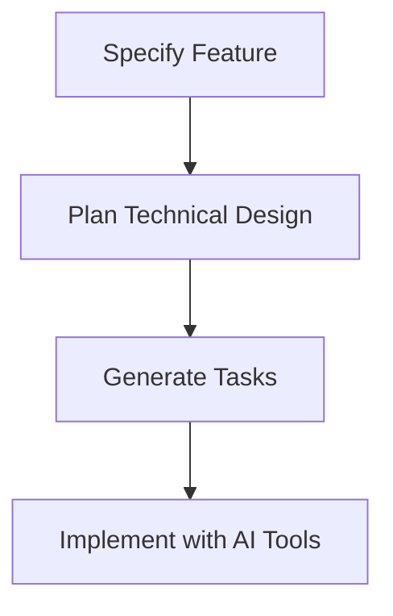

# 🚀 GitHub Spec Kit Guide

[](LICENSE)

---

## 📦 Introduction

**GitHub Spec Kit** is an open-source toolkit for Spec-Driven Development (SDD), helping teams create structured project specs before coding. It works with AI coding assistants and tools like Windsurf, Gemini CLI, Codex, and GitHub Copilot for smooth project planning and implementation.

---

## 🎯 Features

- 📝 Transform ideas into specs: `/specify`
- 🛠️ Generate technical plans: `/plan`
- 📋 Break plans into tasks: `/tasks`
- 🤖 AI-assisted code implementation from specs and tasks
- 🔌 Integrations: Windsurf, Gemini CLI, Codex, GitHub Copilot

---

## ⚡ Quick Command Reference

| Command                                    | Description                                  | Example Usage                                                |
|---------------------------------------------|----------------------------------------------|--------------------------------------------------------------|
| `specify init <project-name>`               | Initialize a new Spec Kit workspace          | `specify init my-awesome-app`                                |
| `specify /specify <feature> "<desc>"`       | Create spec for a feature                    | `specify /specify login "User authentication and login"`     |
| `specify /plan <feature>`                   | Generate technical plan for a feature        | `specify /plan login`                                        |
| `specify /tasks <feature>`                  | Create tasks from plan                       | `specify /tasks login`                                       |
| `specify run <task>`                        | Run a generated task                         | `specify run setup-authentication`                           |
| `specify status`                            | Show current spec/project status             | `specify status`                                             |
| `specify help`                              | Show help info and available commands        | `specify help`                                               |

---

## 🛠️ Getting Started

### Prerequisites

- Git (v2.40+)
- Node.js (v18+ recommended)
- Python 3.10+ (advanced scripting)
- GitHub account (SSH recommended)

### Installation

```bash
git clone https://github.com/github/spec-kit.git
cd spec-kit
ls templates/
# plan-template.md  spec-template.md  tasks-template.md
```

---

## 🚦 Workflow Overview



---

## 🗂️ Folder Structure

```
.project-root/
├── .specify/
│   ├── memory/
│   ├── scripts/
│   ├── specs/
│   ├── templates/
├── specs/
├── plans/
├── tasks/
└── source-code/
```

---

## 🔗 Useful Links

- [GitHub Spec Kit Repo](https://github.com/github/spec-kit)
- [Spec Kit Docs & Templates](https://github.github.io/spec-kit/)
- [Windsurf Connection Tutorial](https://youtu.be/XGiwp7RlV0c)
- [Gemini CLI Integration Discussion](https://github.com/google-gemini/gemini-cli/discussions/7905)
- [GitHub Copilot](https://github.com/features/copilot)
- [OpenAI Codex Overview](https://openai.com/index/introducing-upgrades-to-codex/)

---

## 🤝 Contributing

Contributions welcome! Please open issues or PRs.

---

## 📄 License

MIT License - see the [LICENSE](LICENSE) file for details.

---

## 🎯 Workflow Summary

1. **Specify feature** → 2. **Plan design** → 3. **Generate tasks** → 4. **Implement (AI tools)**

_All managed via Spec Kit CLI and integrated with AI coding assistants._

---

## 💡 FAQ / Troubleshooting

- **Q:** Command not found?
  - **A:** Check your PATH and that Spec Kit CLI is installed.
- **Q:** How do I connect Gemini CLI?
  - **A:** See integration guide [here](https://github.com/google-gemini/gemini-cli/discussions/7905).

---

